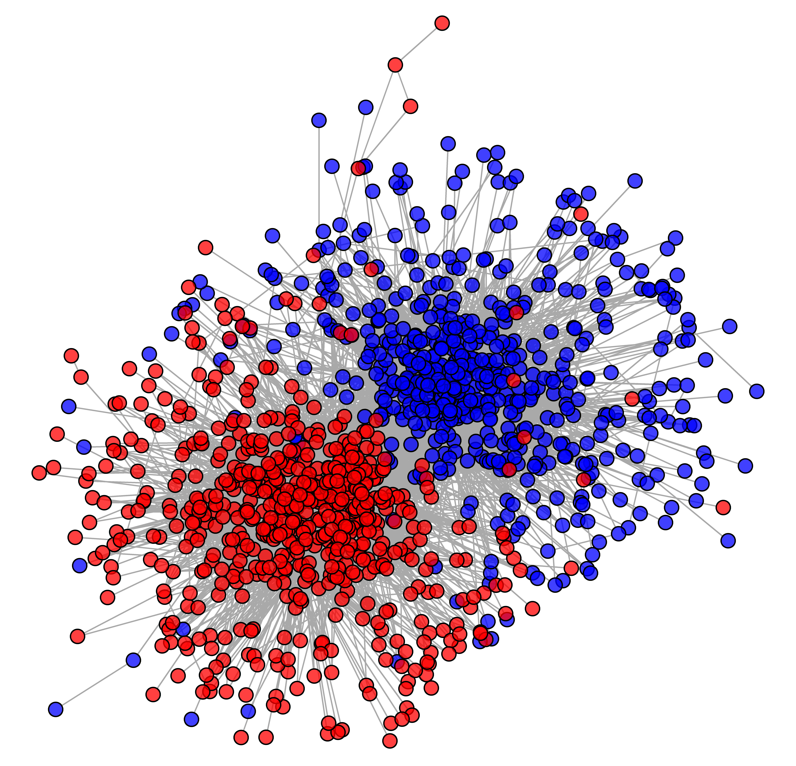
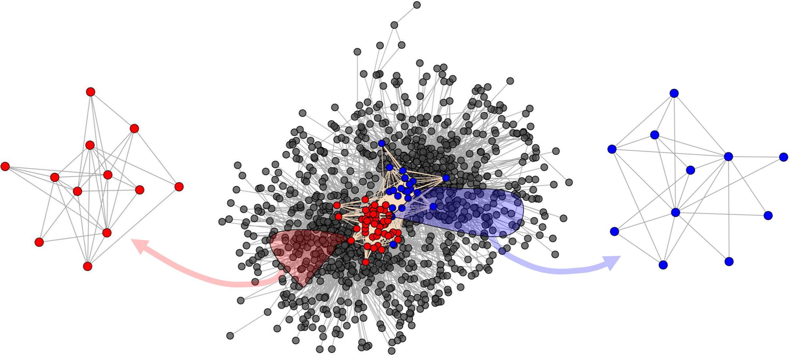
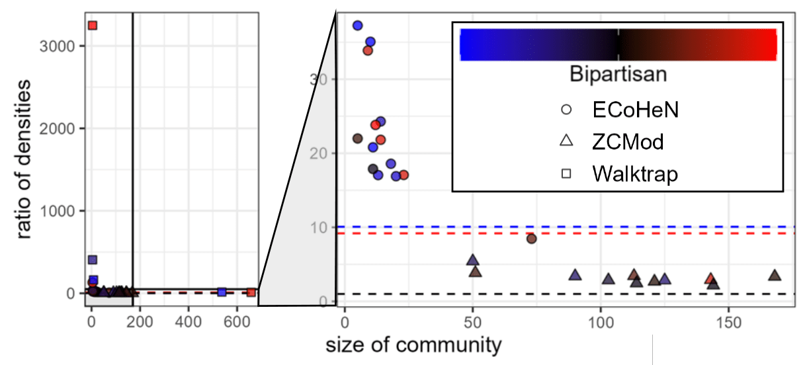

<!-- README.md is generated from README.Rmd. Please edit that file -->

```{r, include = FALSE}
knitr::opts_chunk$set(
  collapse = TRUE,
  comment = "#>",
  fig.path = "man/figures/README-",
  out.width = "100%",
  fig.align = 'center',
  cache = TRUE
)
library(ECoHeN)
library(ggplot2)
library(ggforce)
library(grid)
set.seed(6262)
```

# Extracting Communities from Heterogeneous Networks (ECoHeN)

<!-- badges: start -->
<!-- badges: end -->

The ECoHeN package is composed many useful functions when working with heterogeneous networks. Functionality includes:

* Extracting communities from a heterogeneous network (ECoHeN) with ECoHeN: `cluster_ECoHeN`,
* Extracting a community from an arbitrary seed set(s): `extract_ECoHeN`
* Extracting statistically significant communities (ESSC) with ESSC: `cluster_ESSC`,
* Refining extracted communities: `refine_ECoHeN`,
* Partitioning a heterogeneous network with ZCMod: `cluster_ZCMod`,
* Evaluating the assortativity of a discovered community: `eval_community`,
* Sampling random heterogeneous networks with the same collection of heterogeneous degree sequences: `sample_heterogeneous_dcm`,
* Sampling random heterogeneous networks with specified block structure: `sample_heterogeneous_sbm`,
* Visualizing the block structure of sampled networks with block structure: `viz_heterogeneous_sbm`,
* Evaluating the overlap between simulated community structure and discovered communities: `eval_jaccard`, and
* Converting between membership vectors, reported by partitioning methods, and a collection of communities, reported by extraction methods: `convert_affiliation`.

The extraction procedure of the ECoHeN algorithm in written in `C++`, and the algorithm can easily be parallelized across initialized seed sets using the `future` package. We demonstrate the capability of ECoHeN in the empirical data analysis.

## Installation

You can install the development version of ECoHeN from [GitHub](https://github.com/) with:

```{r, eval=FALSE}
# install.packages("devtools")
devtools::install_github("ConGibbs10/ECoHeN")
```

## Empirical Data Analysis

To illustrate the utility of ECoHeN in practice, we extract communities from the political blogs network of Adamic and Glance (2005). This iconic network consists of political blogs (represented as nodes) and the hyperlinks between them (represented as undirected edges). Collected shortly after the 2004 U.S. presidential election, the largest connected component of the political blogs network consists of 1222 blogs and 16,714 links. Blogs were classified according to their political ideology based on a text analysis of their content, where the 636 red nodes represent conservative leaning blogs and the 586 blue nodes represent liberal leaning blogs. There are drastically more connections between blogs of the same political ideology (precisely 15,139) than connections between blogs of differing political ideology (precisely 1,575). This translates to a propensity of connection between liberal (conservative) blogs of 0.043 (0.039), whereas the propensity of connection between liberal and conservative blogs is 0.004.

```{r, out.width='60%', eval=FALSE}
# load the political blogs dataset and save as G
G <- political_blogs
# plot the network
par(mar = c(0, 0, 0, 0) + 0.1)
plot(
  G,
  layout = G$plot_params$layout,
  xlim = G$plot_params$xlim,
  ylim = G$plot_params$ylim,
  rescale = G$plot_params$rescale,
  vertex.label = NA,
  vertex.size = G$plot_params$vertex.size,
  vertex.color = adjustcolor(igraph::V(G)$color, 
                             alpha.f = G$plot_params$vertex.alpha)
)
```



When ECoHeN is applied to the political blogs network at $\xi=1$ and $\phi=0.99$ with the political ideology labels, 81 communities are found. To speed up the extraction procedure, set $\phi=0.6$, for example. The number of communities is likely overstated due to a significant amount of overlap among the discovered communities. As such, these 81 communities are refined such that each community has at least four nodes with a $\beta = 0.10$ for maximum Jaccard overlap, which results in a set of 15 communities that overlap yet are largely distinct.

```{r, message=FALSE}
# parallelize the extraction procedure
future::plan('multisession', workers = future::availableCores()-1)

# extract communities using ECoHeN
pb_ecohen <- cluster_ECoHeN(
  political_blogs,
  node_type = 'color',
  alpha = 0.1,
  learning_rate = 1,
  decay_rate = 0.99
)
# get number of communities
length(pb_ecohen$communities)

# refine extracted communities
pb_ecohen_refined <- refine_ECoHeN(
  political_blogs,
  ecs = pb_ecohen,
  beta = 0.1,
  min_size = 4,
  verbose = FALSE
)
# get number of communities
length(pb_ecohen_refined$communities)
```

The largest partisan (homogeneous) and bipartisan (heterogeneous) communities identified by ECoHeN are presented below.

```{r, echo=FALSE, fig.align='center'}

```

To gauge the quality of the 15 communities extracted by ECoHeN, we compute the **ratio of densities** (RatD) for each community; that is, we compute the density of links among community members divided by the density of links between community members and the rest of the network. The RatD for all liberal (conservative) blogs is a natural baseline when assessing the assortativity of communities composed near entirely of liberals (conservatives). In general, a RatD of one implies that the density of links within a set of nodes is equivalent to the density of links to the rest of the network and is a natural baseline when assessing the assortativity of an identified community regardless of community members' political affiliation.

```{r}
vattrs <- igraph::vertex_attr(political_blogs, name = 'color')
conservative_vids <- which(vattrs == 'red')
liberal_vids <- which(vattrs == 'blue')

# compute RatD for all liberals and conservatives
eval_community(political_blogs, vids = conservative_vids)$ratD
eval_community(political_blogs, vids = liberal_vids)$ratD

# compute RatD for a random set of 600 nodes
eval_community(political_blogs, vids = sample(1:igraph::vcount(political_blogs), 
                                              size = 600, replace = FALSE))$ratD
```

For comparison, we apply ZCmod and Walktrap to the political blogs network, attain respectively 11 and 5 communities with at least four members, and compute the RatD for each identified community. To assess political composition of each community, we compute the proportion of liberals (equivalently, conservatives) in each community.

```{r, message=FALSE}
# partition 
pb_walktrap <- igraph::cluster_walktrap(political_blogs)
# partition the network with ZCMod
pb_zcmod <- cluster_ZCMod(political_blogs, node_type = 'color', iter = 10)


# compute the ratio of densities for both, along with other statistics
community_statistics <-
  purrr::map2_dfr(list(pb_ecohen_refined, pb_zcmod, pb_walktrap),
                  c('ECoHeN', 'ZCMod', 'Walktrap'),
                  function(ecs, method) {
                    cstats <- purrr::map_dfr(ecs$communities, function(community) {
                      eval_community(political_blogs, vids = community)
                    })
                    cstats$method <- method
                    cstats
                  })
```

The figure below provides the RatD for each identified community along with the size and political composition of the community. When the network is partitioned irrespective of political affiliation with Walktrap, at least one community is largely comprised of liberals and one community is largely comprised of conservatives, a rather trivial partition. When the network is partitioned via heterogeneous modularity maximization using ZCmod, the resulting communities must maintain at least one node of each node type, a rather stringent assumption. In comparison, ECoHeN is able to identify small, bipartisan and partisan communities, each with a connection density higher than competing methods. To speed up optimization, set the number of iterations to five, for example. The figure below provides the RatD for each identified community along with the size of the community and whether it is partisan or bipartisan.



Both ECoHeN and ZCmod result in communities whose links are relatively more dense internally than to the rest of the network; however, the ratio of densities observed from ECoHeN communities are much higher than those communities from ZCmod. The larger RatD is partly because 1) the ECoHeN communities tend to be smaller than the ZCmod communities and 2) the fact that ZCmod is a partitioning method and must assign each node to a community, potentially diluting the density of otherwise well-connected collections of nodes. Nevertheless, the largest ECoHeN community has a RatD that is about 1.6 times larger than the ZCmod community with the largest RatD, both of which are largely bipartisan communities.

This application highlights the importance of conditioning on node type when performing community discovery. Since partisan links are particularly common compared to bipartisan links, the partisan communities identified by ECoHeN are also particularly dense---denser than the natural baseline induced from taking all liberals or all conservatives, respectively. On the other hand, the RatD required by ECoHeN to consider a set of bipartisan nodes a community is naturally lower, a testament to the strengths of ECoHeN as it leverages differences in the connectivity between node types. If a less connected political party, say independents, were included in the network, ECoHeN would be uniquely positioned to identify both partisan and bipartisan communities including independents since ECoHeN identifies communities considering the density with respect to type and does not place constraints or assumptions on the political composition of each community.
