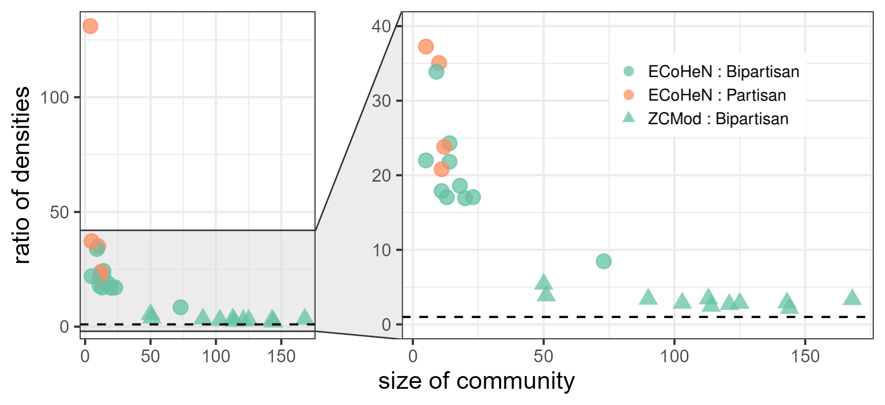

<!-- README.md is generated from README.Rmd. Please edit that file -->

# Extracting Communities from Heterogeneous Networks (ECoHeN)

<!-- badges: start -->
<!-- badges: end -->

The ECoHeN package is composed many useful functions when working with
heterogeneous networks. Functionality includes:

-   Extracting communities from a heterogeneous network (ECoHeN) with
    ECoHeN: `cluster_ECoHeN`,
-   Extracting a community from an arbitrary seed set(s):
    `extract_ECoHeN`
-   Extracting statistically significant communities (ESSC) with ESSC:
    `cluster_ESSC`,
-   Refining extracted communities: `refine_ECoHeN`,
-   Partitioning a heterogeneous network with ZCMod: `cluster_ZCMod`,
-   Evaluating the assortativity of a discovered community:
    `eval_community`,
-   Sampling random heterogeneous networks with the same collection of
    heterogeneous degree sequences: `sample_heterogeneous_dcm`,
-   Sampling random heterogeneous networks with specified block
    structure: `sample_heterogeneous_sbm`,
-   Visualizing the block structure of sampled networks with block
    structure: `viz_heterogeneous_sbm`,
-   Evaluating the overlap between simulated community structure and
    discovered communities: `eval_jaccard`, and
-   Converting between membership vectors, reported by partitioning
    methods, and a collection of communities, reported by extraction
    methods: `convert_affiliation`.

The extraction procedure of the ECoHeN algorithm in written in C++, and
the algorithm can easily be parallelized across initialized seed sets
using the `future` package. We demonstrate the capability of ECoHeN in
the empirical data analysis.

## Installation

You can install the development version of ECoHeN from
[GitHub](https://github.com/) with:

``` r
# install.packages("devtools")
devtools::install_github("ConGibbs10/ECoHeN")
```

## Empirical Data Analysis

We consider the political blogs network by Adamic and Glance (2005): a
network of political blogs (represented as nodes) and the hyperlinks
between them (represented as undirected edges). Collected shortly after
the 2004 U.S. presidential election, the largest connected component of
the political blogs network consists of 1222 blogs and 16,714 links.
Blogs are colored according to their political ideology based on a text
analysis of their content, where the 636 red nodes represent
conservative leaning blogs and the 586 blue nodes represent liberal
leaning blogs. There are drastically more connections between blogs of
the same political ideology, precisely 15,139, than connections between
blogs of differing political ideology, precisely 1575.

``` r
# load the political blogs dataset and save as G
G <- political_blogs
# plot the network
par(mar = c(0, 0, 0, 0) + 0.1)
plot(
  G,
  layout = G$plot_params$layout,
  xlim = G$plot_params$xlim,
  ylim = G$plot_params$ylim,
  rescale = G$plot_params$rescale,
  vertex.label = NA,
  vertex.size = G$plot_params$vertex.size,
  vertex.color = adjustcolor(igraph::V(G)$color, 
                             alpha.f = G$plot_params$vertex.alpha)
)
```


When ECoHeN is applied to the political blogs network at

and
,
conditioning on the observed political ideology, 81 communities are
found. To speed up the extraction procedure set
,
for example. The number of communities is likely overstated due to a
significant amount of overlap among the discovered communities. As such,
these 81 communities are refined to a set of 15 communities with at
least four nodes which must not overlap with any other community more
than 0.10 as measured by the Jaccard similarity measure.

``` r
# parallelize the extraction procedure
future::plan('multisession', workers = future::nbrOfWorkers())

# extract communities using ECoHeN
pb_ecohen <- cluster_ECoHeN(
  political_blogs,
  node_type = 'color',
  alpha = 0.1,
  learning_rate = 1,
  decay_rate = 0.99
)
# get number of communities
length(pb_ecohen$communities)
#> [1] 81

# refine extracted communities
pb_ecohen_refined <- refine_ECoHeN(
  political_blogs,
  ecs = pb_ecohen,
  beta = 0.1,
  min_size = 4,
  verbose = FALSE
)
# get number of communities
length(pb_ecohen_refined$communities)
#> [1] 15
```

The largest partisan (homogeneous) and bipartisan (heterogeneous)
communities identified by ECoHeN are presented below.


To gauge the quality of the 15 communities extracted by ECoHeN, we
compute the ratio of densities (RatD) for each community; that is, we
compute the density of links among community members divided by the
density of links between community members and the rest of the network.
A RatD of one implies that the density of links within a set of nodes is
equivalent to the density of links to the rest of the network, a natural
baseline when assessing the assortativity of an identified community.
For comparison, we apply ZCMod to the political blogs network with 10
iterations, attain 12 communities, and compute the RatD for each. To
speed up optimization, set the number of iterations to five, for
example. The figure below provides the RatD for each identified
community along with the size of the community and whether it is
partisan or bipartisan.

``` r
# partition the network with ZCMod
pb_zcmod <- cluster_ZCMod(political_blogs, node_type = 'color', iter = 10)
# get number of communities
length(pb_zcmod$communities)
#> [1] 12

# compute the ratio of densities for both, along with other statistics
community_statistics <-
  purrr::map2_dfr(list(pb_ecohen_refined, pb_zcmod),
                  c('ECoHeN', 'ZCMod'),
                  function(ecs, method) {
                    cstats <- purrr::map_dfr(ecs$communities, function(community) {
                      eval_community(political_blogs, vids = community)
                    })
                    cstats$method <- method
                    cstats
                  })
```

The figure below provides the RatD for each identified community along
with the size of the community and whether it is partisan or bipartisan.
The RatD for each of the 15 communities extracted from ECoHeN (plotted
as circles) and 11 communities detected from ZCMod (plotted as
triangles) along with the size of the communities. Each community is
identified as partisan (in pink) or bipartisan (in blue). As opposed to
ZCMod, ECoHeN can identify both partisan and bipartisan communities. The
largest bipartisan community community found by ECoHeN features a RatD
nearly 1.6 times larger than the largest ratio of densities attained via
ZCMod.



A key advantage of ECoHeN is its ability to discover bipartisan and
partisan communities, whereas ZCmod is confined to only bipartisan
communities. The RatD observed from ECoHeN communities are much higher
than those communities from ZCmod. The larger RatD is partly because 1)
the ECoHeN communities tend to be smaller than the ZCmod communities and
2) the fact that ZCmod is a partitioning method and must assign each
node to a community, potentially diluting the density of otherwise
well-connected collections of nodes. Nevertheless, the largest ECoHeN
community has a RatD that is about 1.6 times larger than the ZCmod
community with the largest RatD. This application highlights the
importance of conditioning on node type when performing community
discovery. Since partisan links are particularly common compared to
bipartisan links, the partisan communities identified by ECoHeN are also
particularly dense. On the other hand, the RatD required by ECoHeN to
consider a set a bipartisan nodes a community is naturally lower, a
testament to the strengths of ECoHeN as it leverages differences in the
connectivity between node types.
